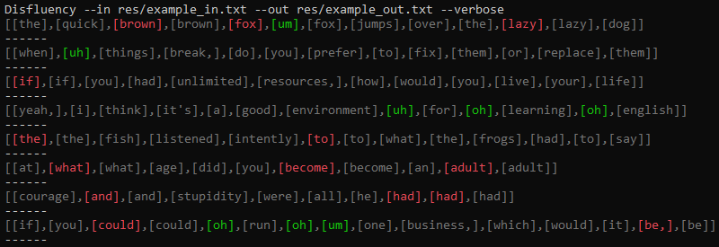

# Disfluency Generator
A C++ program that parses a file containing a list of sentences and purposefully adds errors to generate a data set for an LSTM.

## How to use
Execute this in the command line:

```Disfluency --[i]n [input_file] --[o]ut [output_file] [--verbose]```

#### Result (via command line)


#### Result (in example_out.txt)
```[the quick brown brown fox um fox jumps over the lazy lazy dog], [the quick brown fox jumps over the lazy dog.]
[when uh things break, do you prefer to fix them or replace them], [when things break, do you prefer to fix them or replace them?]
[if if you had unlimited resources, how would you live your life], [if you had unlimited resources, how would you live your life?]
[yeah, i think it's a good environment uh for oh learning oh english], [yeah, i think it's a good environment for learning english.]
[the the fish listened intently to to what the frogs had to say], [the fish listened intently to what the frogs had to say.]
[at what what age did you become become an adult adult], [at what age did you become an adult?]
[courage and and stupidity were all he had had had], [courage and stupidity were all he had.]
[if you could could oh run oh um one business, which would it be, be, and how would you change it], [if you could run one business, which would it be, and how would you change it?]
```
